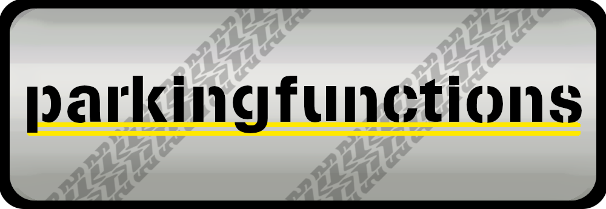

# parkingfunctions

[-> READ THE DOCS HERE <-](https://parkingfunctions.readthedocs.io/en/latest/index.html)

**parkingfunctions** is a simple Python library that provides tools to generate and validate parking functions!